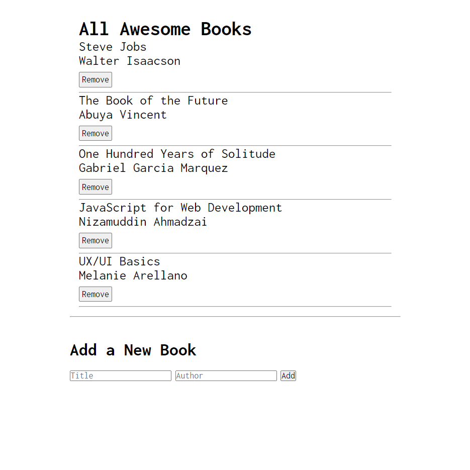

# Awesome Books

> A simple library for you to save a list of your favorite books.

## Built With

- HTML
- CSS
- JavaScript

## Authors

👤 **Nizamuddin Ahmadzai**

- GitHub: [@Nizammudin4493](https://github.com/Nizamuddin4493)
- Twitter: [@Nizammudin4493](https://twitter.com/Nizamuddin4493)
- LinkedIn: [nizam-udd-in-ahmadzai](https://linkedin.com/in/nizam-udd-in-ahmadzai)

👤 **Abuya Obunga**

- GitHub: [@vabuyia](https://github.com/vabuyia)
- Twitter: [@abuyiag](https://twitter.com/abuyiag)
- LinkedIn: [LinkedIn](https://linkedin.com/in/vincent-abuya-a1940555)

## 🤝 Contributing

Contributions, issues, and feature requests are welcome!

Feel free to check the [issues page](../../issues/).

## Show your support

Give a ⭐️ if you like this project!

## Acknowledgments

- Hat tip to our code reviewers on Microverse

## 📝 License

This project is [MIT](./MIT.md) licensed.