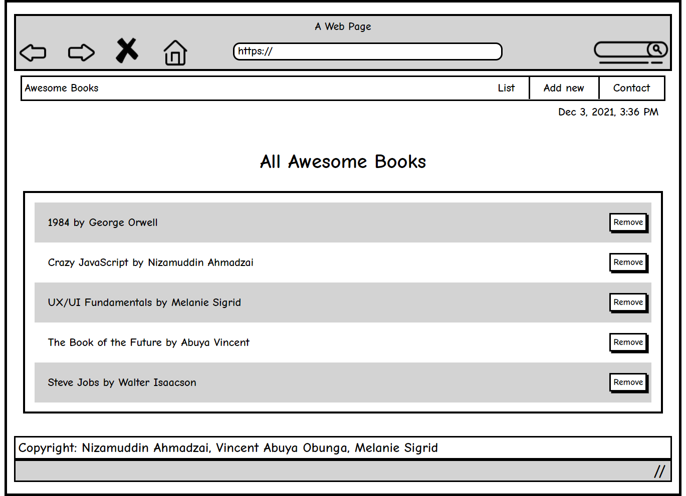

# Awesome Books

> A simple library for you to save a list of your favorite books.

## Run the Project Locally
- To Clone the Project Locally Please click the following link.
- [Awesome Books](https://github.com/vabuyia/Awesome-Book)
- The click on Green Code button
- Copy the SSH link and clone it Locally through your Code Editor's terminal.

## Built With

- HTML
- CSS
- JavaScript
- Luxon

## Authors

👤 **Nizamuddin Ahmadzai**

- GitHub: [@Nizamudin4493](https://github.com/Nizamuddin4493)
- Twitter: [@Nizamudin4493](https://twitter.com/Nizamuddin4493)
- LinkedIn: [nizamuddin4493](https://linkedin.com/in/nizamuddin4493)

👤 **Vincent Abuya Obunga**

- GitHub: [@vabuyia](https://github.com/vabuyia)
- Twitter: [@abuyiag](https://twitter.com/abuyiag)
- LinkedIn: [LinkedIn](https://linkedin.com/in/vincent-abuya-a1940555)

👤 **Melanie Sigrid Arellano Baratto**

- GitHub: [@melaniesigrid](https://github.com/melaniesigrid)
- Twitter: [@SiriMoon11](https://twitter.com/SiriMoon11)
- LinkedIn: [LinkedIn](https://www.linkedin.com/in/melanie-arellano-92aaa9194/)

## 🤝 Contributing

Contributions, issues, and feature requests are welcome!

Feel free to check the [issues page](../../issues/).

## Show your support

Give a ⭐️ if you like this project!

## Acknowledgments

- Hat tip to our code reviewers on Microverse

## 📝 License

This project is [MIT](./MIT.md) licensed.
